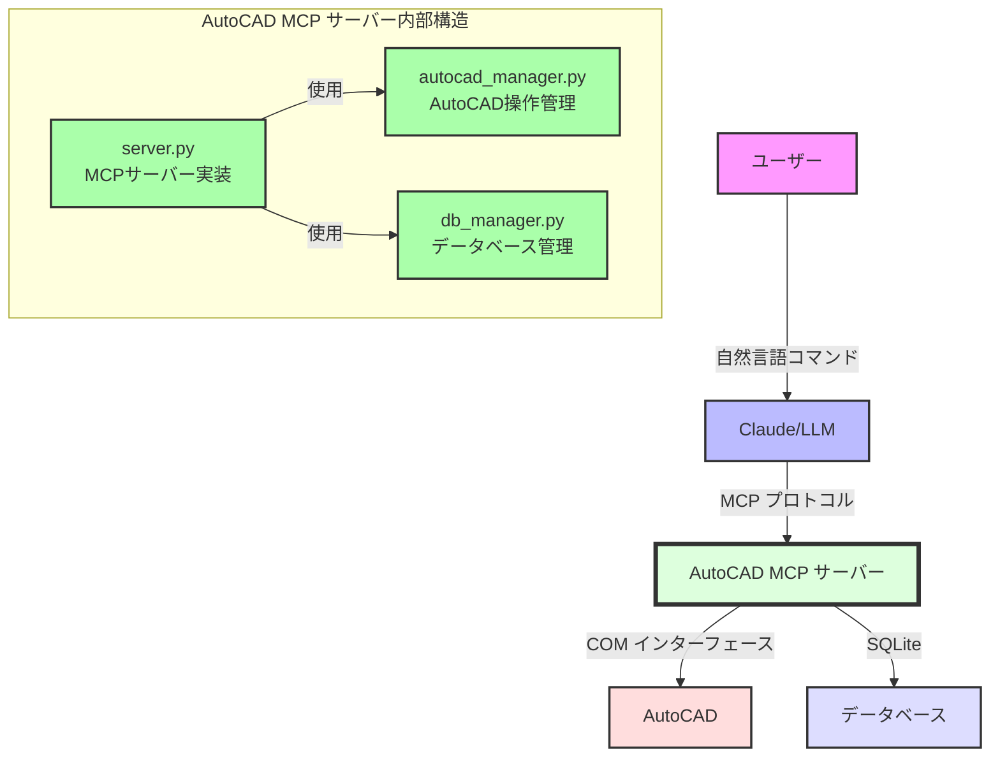
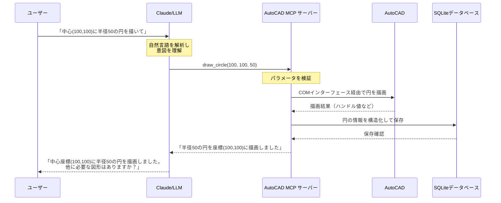
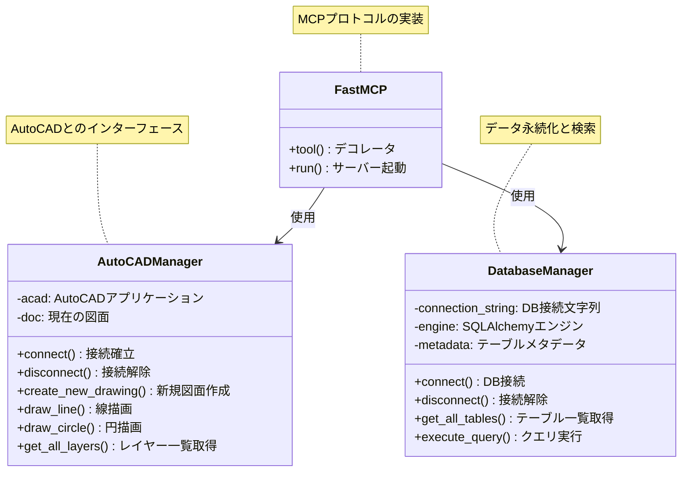
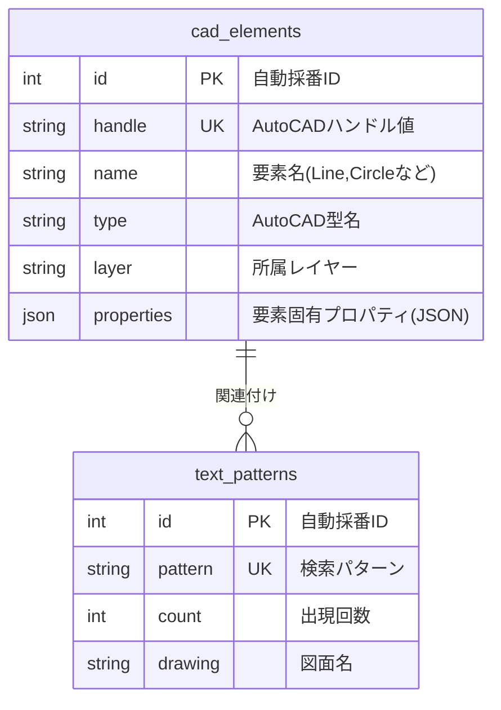

# AutoCAD MCP サーバー

**Model Context Protocol (MCP)** を基盤としたAutoCAD統合サーバーで、**Claude**などの大規模言語モデル(LLM)とAutoCADの間で自然言語による対話を可能にします。

## 概要

設計・製図業務において、AutoCADは業界標準ツールとして広く使用されていますが、複雑なコマンド体系の習得には時間がかかり、効率的な操作には専門知識が必要です。本プロジェクトは、この課題を解決するために、AIアシスタントとAutoCADの間に革新的な橋渡しを提供します。

ユーザーは自然言語で意図を伝えるだけで、AIがそれを解釈し、適切なAutoCAD操作に変換します。さらに、図面要素をデータベースに保存・分析する機能により、設計情報の管理と検索が容易になります。これにより、CAD初心者でも専門家レベルの図面作成が可能になり、熟練者は複雑な操作を簡略化できます。

## 機能特徴

- **自然言語による直感的操作**: 「中心点(100,100)に半径50の円を描いて」などの自然な指示でAutoCADを操作
- **インテリジェントな図形描画**: 基本図形（線、円、弧など）の描画に加え、文脈を理解した複合図形の作成をサポート
- **高度なレイヤー管理**: レイヤーの作成、変更、削除、プロパティ設定などを自然言語で制御
- **専門図面の自動生成**: PMCコントロール図などの業界特化型図面を自動生成し、標準化と効率化を実現
- **コンテキスト認識型図面分析**: 既存図面の要素を意味的に解析し、設計意図を理解
- **パターンベースの要素検索**: 特定のテキストパターンや図形特性に基づく高度な検索と視覚的ハイライト
- **永続的知識ベース**: SQLiteデータベースによるCAD要素の保存と検索で、設計知識を蓄積・活用

## システム要件

- **Python** 3.10以上
- **AutoCAD** 2018以上（COMインターフェースをサポートするバージョン）
- **Windows** オペレーティングシステム（COM依存のため）
- **メモリ** 8GB以上推奨（大規模図面処理時）

## システムアーキテクチャ

以下の図は、システム全体のアーキテクチャを示しています。ユーザーからの自然言語指示がLLMによって解釈され、MCPサーバーを通じてAutoCADの操作に変換される流れを表しています。



## データフロー

以下のシーケンス図は、ユーザーからの指示がどのように処理され、結果が返されるかを時系列で示しています。非同期処理や各コンポーネント間の相互作用が明確に理解できます。



## コンポーネント構成

以下のクラス図は、システムの主要コンポーネントとその関係性を示しています。オブジェクト指向設計の原則に基づいた明確な責任分担が実現されています。



## インストール方法

### 1. リポジトリのクローン

```sh
git clone https://github.com/yourusername/autocad-mcp-server.git
cd autocad-mcp-server
```

### 2. 仮想環境の作成と有効化

Windows:
```sh
python -m venv .venv
.venv\Scripts\activate
```

macOS / Linux:
```sh
python -m venv .venv
source .venv/bin/activate
```

### 3. 依存パッケージのインストール

```sh
pip install -r requirements.txt
```

インストールされる主要パッケージ:
- mcp: Model Context Protocolの実装
- pywin32: Windows COMインターフェース
- pyautocad: AutoCAD操作の簡略化
- sqlalchemy: データベースORM

### 4. （オプション）実行ファイルのビルド

```sh
pyinstaller --onefile server.py
```

ビルドにより、依存関係を含む単一の実行ファイルが作成され、Python環境のないシステムでも実行可能になります。

## 使用方法

### スタンドアロンサーバーとして実行

```sh
python server.py
```

サーバーは標準入出力を通じてMCPプロトコルで通信します。デバッグ情報は標準エラー出力に表示されます。

### Claude Desktopとの統合

**Claude Desktop**の設定ファイルを編集します（パスは以下の通り）:

- Windows: %APPDATA%\Claude\claude_desktop_config.json
- macOS: ~/Library/Application Support/Claude/claude_desktop_config.json

設定例:

```json
{
  "mcpServers": {
    "autocad-mcp-server": {
      "command": "path/to/autocad_mcp_server.exe",
      "args": [],
      "env": {
        "PYTHONIOENCODING": "utf-8"
      }
    }
  }
}
```

設定後、Claude Desktopを再起動すると、AutoCAD操作機能が自動的に利用可能になります。

## 利用可能なツール（API機能）

| 機能 | 説明 | 使用例 |
|------|------|------|
| `create_new_drawing` | 新しいAutoCAD図面を作成 | 「新しい図面を作成して」 |
| `draw_line` | 直線を描画 | 「点(0,0)から(100,100)に線を引いて」 |
| `draw_circle` | 円を描画 | 「中心(150,150)に半径30の円を描いて」 |
| `scan_all_entities` | 図面内のすべての要素をスキャンしてDB保存 | 「図面内の全要素をスキャンして」 |
| `highlight_entity` | 指定したハンドルの要素をハイライト表示 | 「ハンドル"2A3"の要素を赤色でハイライト」 |
| `count_text_patterns` | 特定テキストパターンの出現回数をカウント | 「"PMC-3M"というテキストを検索して」 |
| `highlight_text_matches` | 特定テキストパターンを含む要素をハイライト | 「"PMC"を含むテキストを黄色でハイライト」 |
| `get_all_tables` | データベース内のすべてのテーブルを取得 | 「データベースのテーブル一覧を表示して」 |
| `execute_query` | カスタムSQLクエリを実行 | 「"SELECT * FROM cad_elements"を実行して」 |
| `query_and_highlight` | SQLクエリ結果に基づいて要素をハイライト | 「半径が20より大きい円をハイライトして」 |

## 技術的詳細

### サーバーコンポーネント

1. **server.py**: MCPサーバーのメイン実装。FastMCPを使用してツールを定義し、AutoCADとデータベースの操作を統合的に管理します。エラーハンドリングと非同期処理に特に注力しています。

2. **autocad_manager.py**: AutoCADとの連携を管理するクラス。COM経由でAutoCADを操作し、図面の作成や編集を行います。コンテキストマネージャパターンを採用し、リソース管理を最適化しています。

3. **db_manager.py**: SQLAlchemyを使用したデータベース操作を管理するクラス。ORMとSQLの両方のアプローチをサポートし、柔軟なデータアクセスを実現しています。

### データベーススキーマ



## 現在の制限と今後の課題

- **Windows環境依存**: COMインターフェースに依存しているため、現状ではWindows環境でのみ動作します。将来的にはクラウドCADとの連携によるクロスプラットフォーム対応を検討中です。

- **同時実行の制限**: 現在の実装では、複数のLLMからの同時アクセスに制限があります。将来的にはマルチセッション対応を実装予定です。

- **高度なCAD機能**: 現状では基本的なCAD機能のみ実装されています。今後、寸法記入、ハッチング、3Dモデリングなどの高度な機能を追加予定です。

## 貢献とフィードバック

本プロジェクトは継続的に改善を行っています。バグ報告、機能リクエスト、プルリクエストなどの貢献を歓迎します。詳細な技術情報は`TECHNICAL_GUIDE_JP.md`を、使用例は`TUTORIAL_JP.md`をご参照ください。

---