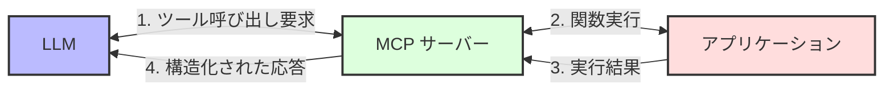
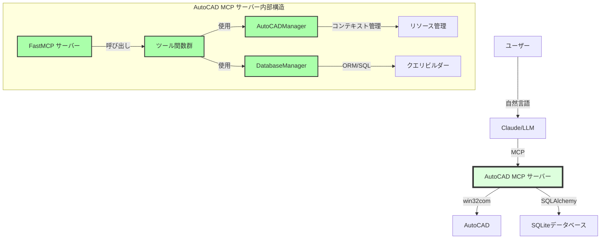
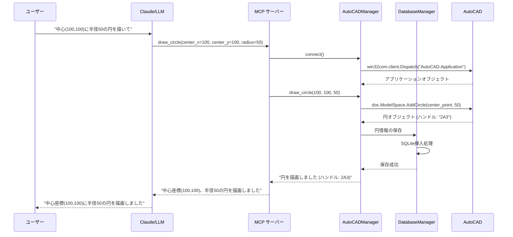
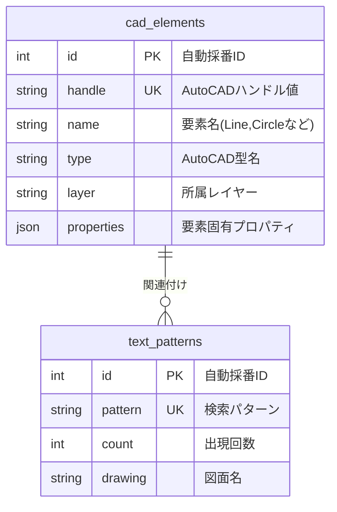
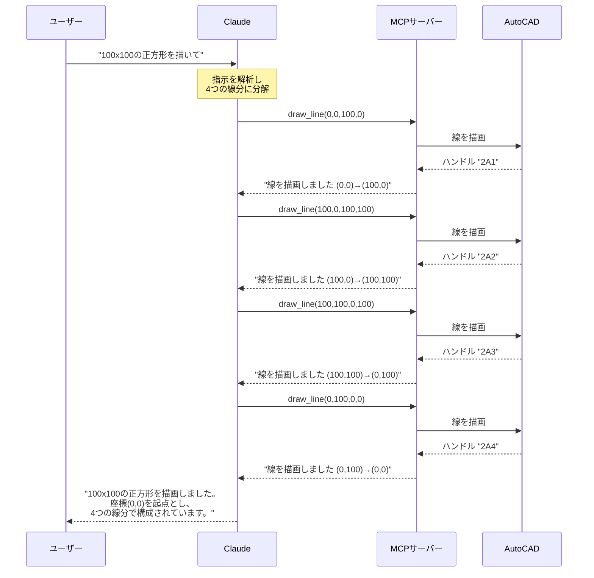
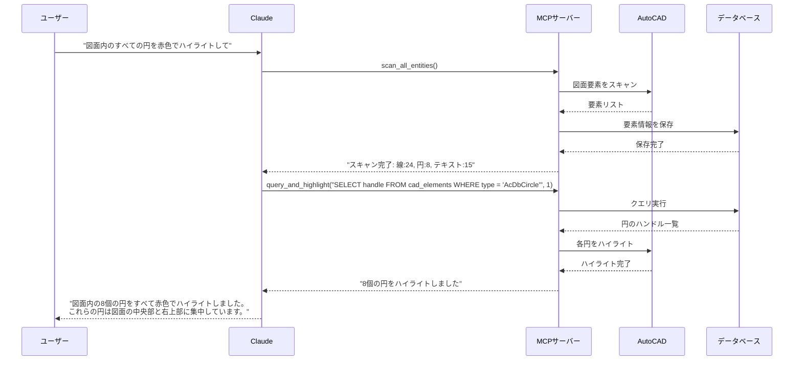
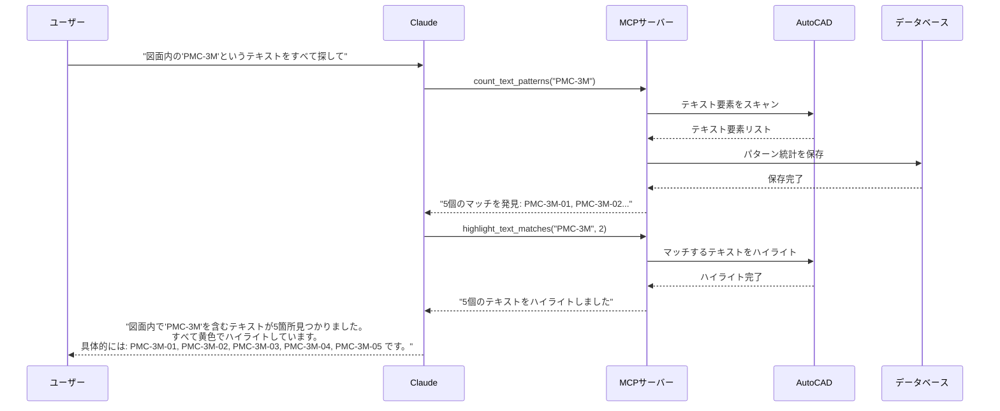

# AutoCAD MCP サーバー 技術ガイド

このドキュメントでは、AutoCAD MCP サーバーの技術的な詳細、アーキテクチャ、および実装について詳しく解説します。開発者がシステムを理解し、拡張するための包括的な情報を提供します。

## 目次

1. [MCPの概要と仕組み](#mcpの概要と仕組み)
2. [システムアーキテクチャ](#システムアーキテクチャ)
3. [コアコンポーネント](#コアコンポーネント)
4. [データベース設計](#データベース設計)
5. [APIツール詳細](#apiツール詳細)
6. [ユースケースシナリオ](#ユースケースシナリオ)
7. [拡張と開発ガイド](#拡張と開発ガイド)
8. [パフォーマンス最適化](#パフォーマンス最適化)
9. [セキュリティ考慮事項](#セキュリティ考慮事項)

## MCPの概要と仕組み

### Model Context Protocol (MCP)とは

Model Context Protocol (MCP)は、大規模言語モデル(LLM)とローカルアプリケーションやサービスを連携させるための標準化されたプロトコルです。従来のAPIとは異なり、MCPはLLMが「ツール」と呼ばれる機能を直接呼び出せるようにすることで、AIと既存ソフトウェアの統合を簡素化します。

MCPの主な特徴:
- **標準化されたインターフェース**: 異なるLLMとアプリケーション間の一貫した通信方法
- **双方向通信**: LLMからアプリケーションへの命令と、アプリケーションからLLMへの結果返却
- **型付きパラメータ**: 厳格な型チェックによる安全な関数呼び出し
- **コンテキスト共有**: LLMとアプリケーション間での状態や情報の共有

### MCPの基本的な仕組み



1. **ツール定義**: MCPサーバーは、名前、説明、パラメータスキーマを持つ「ツール」を定義します
2. **ツール呼び出し**: LLMはユーザーの自然言語入力を解釈し、適切なツールとパラメータを選択します
3. **実行**: MCPサーバーはツール呼び出しを受け取り、対応するアプリケーション操作を実行します
4. **結果返却**: 操作結果を構造化された形式でLLMに返し、LLMはそれを自然言語に変換してユーザーに伝えます

### FastMCPフレームワーク

本プロジェクトでは、`FastMCP`ライブラリを使用してMCPサーバーを実装しています。FastMCPは以下の機能を提供します:

- **デコレータベースのツール定義**: Pythonデコレータを使用した直感的なツール登録
- **自動型変換**: JSONとPythonオブジェクト間の自動変換
- **エラーハンドリング**: 標準化されたエラー報告メカニズム
- **非同期サポート**: 長時間実行操作のための非同期処理

```python
# FastMCPの基本的な使用例
from mcp.server.fastmcp import FastMCP, Context

# サーバー初期化
mcp = FastMCP("サーバー名")

# ツール定義
@mcp.tool()
def example_tool(ctx: Context, param1: str, param2: int) -> str:
    """ツールの説明"""
    # 実装...
    return "結果"

# サーバー起動
if __name__ == "__main__":
    mcp.run()
```

## システムアーキテクチャ

### 全体アーキテクチャ

AutoCAD MCP サーバーは、以下の主要コンポーネントで構成される多層アーキテクチャを採用しています:



### レイヤー構造

システムは以下の論理レイヤーに分かれています:

1. **インターフェースレイヤー**: MCPプロトコルを実装し、LLMとの通信を担当
2. **ビジネスロジックレイヤー**: ツール関数群とその実装を含む
3. **統合レイヤー**: AutoCADとデータベースへのアクセスを抽象化
4. **永続化レイヤー**: データの保存と検索を担当

この明確な責任分担により、各コンポーネントの独立した開発とテストが可能になり、システムの保守性と拡張性が向上します。

### コンポーネント間の通信フロー

以下のシーケンス図は、円を描画する際の詳細な通信フローを示しています:



## コアコンポーネント

### 1. server.py

MCPサーバーのメイン実装です。FastMCPを使用してサーバーを初期化し、各種ツールを定義しています。

#### 主要機能:

- MCPサーバーの初期化と実行
- データベースの初期化
- AutoCAD操作ツールの定義
- データベース操作ツールの定義
- エラーハンドリングとロギング

#### 重要な実装パターン:

1. **デコレータベースのツール登録**:
```python
@mcp.tool()
def draw_circle(ctx: Context, center_x: float, center_y: float, radius: float, layer: Optional[str] = None) -> str:
    """AutoCADで円を描画する"""
    try:
        # 実装...
        return f"円を描画しました"
    except Exception as e:
        return f"エラー: {str(e)}"
```

2. **例外処理パターン**:
```python
try:
    # 主要な処理
    if error_condition:
        return f"処理固有のエラー: {error_details}"
    # 成功処理
    return "成功メッセージ"
except SpecificError as e:
    # 特定の例外処理
    return f"特定エラー: {str(e)}"
except Exception as e:
    # 一般的な例外処理
    return f"一般エラー: {str(e)}"
```

3. **データベース初期化**:
```python
def init_db():
    try:
        conn = sqlite3.connect("autocad_data.db")
        cursor = conn.cursor()
        # テーブル作成
        cursor.execute('''
        CREATE TABLE IF NOT EXISTS cad_elements (
            id INTEGER PRIMARY KEY,
            handle TEXT UNIQUE,
            name TEXT NOT NULL,
            type TEXT NOT NULL,
            layer TEXT,
            properties TEXT
        )
        ''')
        # 他のテーブル...
        conn.commit()
        conn.close()
        return True
    except Exception as e:
        print(f"データベース初期化失敗: {str(e)}")
        return False
```

### 2. autocad_manager.py

AutoCADとの連携を管理するクラスです。COMインターフェースを通じてAutoCADを操作します。

#### 主要機能:

- AutoCADへの接続と切断
- 図面の作成と管理
- レイヤーの操作
- 基本図形の描画
- 図面のエクスポート

#### 重要な実装パターン:

1. **コンテキストマネージャパターン**:
```python
@contextmanager
def autocad_session(self):
    """AutoCAD セッションのコンテキストマネージャ"""
    success = self.connect()
    if not success:
        raise Exception("AutoCADに接続できません")
    try:
        yield self
    finally:
        self.disconnect()
```

2. **COMオブジェクト操作**:
```python
def draw_line(self, start_x, start_y, end_x, end_y, layer=None):
    """線を描画する"""
    try:
        # 現在のレイヤーを保存
        current_layer = self.doc.ActiveLayer.Name
        
        # レイヤー切り替え
        if layer:
            # レイヤー処理...
        
        # VARIANT型の作成と線の描画
        start_point = win32com.client.VARIANT(win32com.client.pythoncom.VT_ARRAY | win32com.client.pythoncom.VT_R8, [start_x, start_y, 0])
        end_point = win32com.client.VARIANT(win32com.client.pythoncom.VT_ARRAY | win32com.client.pythoncom.VT_R8, [end_x, end_y, 0])
        line = self.doc.ModelSpace.AddLine(start_point, end_point)
        
        # 元のレイヤーに戻す
        if layer:
            self.doc.ActiveLayer = self.doc.Layers.Item(current_layer)
            
        return line
    except Exception as e:
        raise Exception(f"線の描画に失敗: {str(e)}")
```

3. **リソース管理**:
```python
def disconnect(self):
    """AutoCAD接続を解放"""
    # 明示的にオブジェクト参照を解放
    self.doc = None
    self.acad = None
    # 必要に応じてGCを促進
    import gc
    gc.collect()
```

### 3. db_manager.py

データベース操作を管理するクラスです。SQLAlchemyを使用してデータベースとやり取りします。

#### 主要機能:

- データベース接続の管理
- テーブル情報の取得
- カスタムクエリの実行
- スキーマ情報の取得

#### 重要な実装パターン:

1. **SQLAlchemyセットアップ**:
```python
def connect(self):
    """データベースに接続"""
    try:
        self.engine = create_engine(self.connection_string)
        self.metadata = MetaData()
        self.metadata.reflect(bind=self.engine)
        self.inspector = inspect(self.engine)
        return True
    except Exception as e:
        print(f"データベース接続失敗: {str(e)}")
        return False
```

2. **クエリ実行パターン**:
```python
def execute_query(self, query, params=None):
    """クエリを実行"""
    try:
        with self.engine.connect() as connection:
            if params:
                result = connection.execute(query, params)
            else:
                result = connection.execute(query)
                
            # SELECT結果の処理
            if result.returns_rows:
                columns = result.keys()
                rows = [dict(zip(columns, row)) for row in result]
                return {"columns": columns, "rows": rows}
            else:
                return {"affected_rows": result.rowcount}
    except SQLAlchemyError as e:
        return f"クエリ実行失敗: {str(e)}"
```

## データベース設計

### スキーマ構造

このプロジェクトでは、SQLiteデータベースを使用して2つの主要テーブルを管理しています:

#### 1. cad_elements テーブル

CAD要素（線、円、テキストなど）の情報を保存します。

```sql
CREATE TABLE cad_elements (
    id INTEGER PRIMARY KEY,
    handle TEXT UNIQUE,  -- AutoCADのハンドル値（一意の識別子）
    name TEXT NOT NULL,  -- 要素名（Line, Circleなど）
    type TEXT NOT NULL,  -- AutoCAD型名（AcDbLine, AcDbCircleなど）
    layer TEXT,          -- 所属レイヤー名
    properties TEXT      -- 要素固有のプロパティ（JSON形式）
)
```

#### 2. text_patterns テーブル

図面内のテキストパターンの統計情報を保存します。

```sql
CREATE TABLE text_patterns (
    id INTEGER PRIMARY KEY,
    pattern TEXT UNIQUE,  -- 検索されたテキストパターン
    count INTEGER DEFAULT 0,  -- 出現回数
    drawing TEXT          -- 図面名
)
```

### データモデル



### プロパティJSONの構造

各要素タイプごとに異なるプロパティを保存しています。以下は主要な要素タイプのJSONスキーマです:

#### 線の場合:
```json
{
  "start_point": [100.0, 100.0, 0.0],  // 始点座標 [x, y, z]
  "end_point": [200.0, 200.0, 0.0],    // 終点座標 [x, y, z]
  "length": 141.42,                    // 線の長さ（オプション）
  "angle": 45.0                        // 角度（度）（オプション）
}
```

#### 円の場合:
```json
{
  "center": [150.0, 150.0, 0.0],  // 中心座標 [x, y, z]
  "radius": 50.0,                 // 半径
  "area": 7853.98,                // 面積（オプション）
  "circumference": 314.16         // 円周（オプション）
}
```

#### テキストの場合:
```json
{
  "text": "PMC-3M",                      // テキスト内容
  "position": [100.0, 100.0, 0.0],       // 挿入位置 [x, y, z]
  "height": 2.5,                         // テキスト高さ
  "rotation": 0.0,                       // 回転角度（度）
  "style": "Standard",                   // テキストスタイル（オプション）
  "alignment": "left"                    // 配置（オプション）
}
```

### インデックス戦略

パフォーマンス最適化のため、以下のインデックスを推奨します:

```sql
-- ハンドルによる高速検索
CREATE INDEX idx_cad_elements_handle ON cad_elements(handle);

-- タイプによる検索
CREATE INDEX idx_cad_elements_type ON cad_elements(type);

-- レイヤーによる検索
CREATE INDEX idx_cad_elements_layer ON cad_elements(layer);

-- パターン検索の高速化
CREATE INDEX idx_text_patterns_pattern ON text_patterns(pattern);
```

## APIツール詳細

### 基本的な図形描画ツール

#### 1. create_new_drawing

新しいAutoCAD図面を作成します。

**パラメータ**:
- `template` (オプション): テンプレートファイルのパス

**戻り値**: 成功メッセージまたはエラーメッセージ

**内部処理**:
1. AutoCADアプリケーションに接続
2. 新しい図面を作成（テンプレートがあれば使用）
3. 結果を返却

**エラーハンドリング**:
- AutoCAD接続エラー
- テンプレートファイルが見つからない場合のエラー

**使用例**:
```python
result = create_new_drawing(ctx)  # デフォルトテンプレート
result = create_new_drawing(ctx, template="acad.dwt")  # 指定テンプレート
```

#### 2. draw_line

直線を描画します。

**パラメータ**:
- `start_x`: 始点のX座標
- `start_y`: 始点のY座標
- `end_x`: 終点のX座標
- `end_y`: 終点のY座標
- `layer` (オプション): 描画するレイヤー名

**戻り値**: 成功メッセージ（ハンドル値を含む）またはエラーメッセージ

**内部処理**:
1. AutoCADアプリケーションに接続
2. 指定されたレイヤーが存在しなければ作成
3. VARIANT型を使用して座標を設定
4. 直線を描画
5. 線の情報をデータベースに保存
6. 結果を返却

**エラーハンドリング**:
- AutoCAD接続エラー
- 無効な座標値
- レイヤー作成エラー
- データベース保存エラー

**使用例**:
```python
result = draw_line(ctx, 0, 0, 100, 100)  # 基本的な線
result = draw_line(ctx, 0, 0, 100, 100, layer="寸法線")  # レイヤー指定
```

#### 3. draw_circle

円を描画します。

**パラメータ**:
- `center_x`: 中心点のX座標
- `center_y`: 中心点のY座標
- `radius`: 半径
- `layer` (オプション): 描画するレイヤー名

**戻り値**: 成功メッセージ（ハンドル値を含む）またはエラーメッセージ

**内部処理**:
1. AutoCADアプリケーションに接続
2. 指定されたレイヤーが存在しなければ作成
3. VARIANT型を使用して中心座標を設定
4. 円を描画
5. 円の情報をデータベースに保存
6. 結果を返却

**エラーハンドリング**:
- AutoCAD接続エラー
- 無効な座標値または半径
- レイヤー作成エラー
- データベース保存エラー

**使用例**:
```python
result = draw_circle(ctx, 100, 100, 50)  # 基本的な円
result = draw_circle(ctx, 100, 100, 50, layer="円図形")  # レイヤー指定
```

### 図面分析ツール

#### 1. scan_all_entities

現在の図面内のすべての要素をスキャンし、データベースに保存します。

**パラメータ**: なし

**戻り値**: スキャン結果の統計情報またはエラーメッセージ

**内部処理**:
1. AutoCADアプリケーションに接続
2. データベース接続を確立
3. 既存のレコードをクリア（オプション）
4. モデル空間内のすべての要素を走査
5. 要素タイプを識別し、適切なプロパティを抽出
6. 要素情報をデータベースに保存
7. 統計情報を集計して返却

**エラーハンドリング**:
- AutoCAD接続エラー
- データベースエラー
- 未知の要素タイプ処理エラー

**使用例**:
```python
result = scan_all_entities(ctx)
```

#### 2. highlight_entity

指定したハンドルの要素をハイライト表示します。

**パラメータ**:
- `handle`: 要素のハンドル値
- `color` (オプション): ハイライト色コード（1=赤、2=黄色など）

**戻り値**: ハイライト結果またはエラーメッセージ

**内部処理**:
1. AutoCADアプリケーションに接続
2. 選択セットを作成
3. ハンドルフィルタを使用して要素を選択
4. 要素の色を変更
5. 結果を返却

**エラーハンドリング**:
- AutoCAD接続エラー
- 要素が見つからない場合のエラー
- 色変更エラー

**使用例**:
```python
result = highlight_entity(ctx, "2A3")  # デフォルト色（赤）
result = highlight_entity(ctx, "2A3", color=3)  # 緑色
```

### テキスト分析ツール

#### 1. count_text_patterns

図面内のテキスト要素から特定のパターンを検索し、出現回数をカウントします。

**パラメータ**:
- `pattern`: 検索するテキストパターン（デフォルト: "PMC-3M"）

**戻り値**: 検索結果の詳細またはエラーメッセージ

**内部処理**:
1. AutoCADアプリケーションに接続
2. データベース接続を確立
3. すべてのテキスト要素を走査
4. パターンに一致するテキストをカウント
5. 結果をデータベースに保存
6. 詳細情報を返却

**エラーハンドリング**:
- AutoCAD接続エラー
- データベースエラー
- テキスト処理エラー

**使用例**:
```python
result = count_text_patterns(ctx)  # デフォルトパターン
result = count_text_patterns(ctx, pattern="P-")  # カスタムパターン
```

#### 2. highlight_text_matches

特定のテキストパターンを含むすべてのテキスト要素をハイライト表示します。

**パラメータ**:
- `pattern`: 検索するテキストパターン（デフォルト: "PMC-3M"）
- `color` (オプション): ハイライト色コード

**戻り値**: ハイライト結果またはエラーメッセージ

**内部処理**:
1. AutoCADアプリケーションに接続
2. 選択セットを作成
3. すべてのテキスト要素を走査
4. パターンに一致するテキストの色を変更
5. 選択セットに追加
6. 結果を返却

**エラーハンドリング**:
- AutoCAD接続エラー
- 選択セット作成エラー
- 色変更エラー

**使用例**:
```python
result = highlight_text_matches(ctx, "PMC-3M")  # デフォルト色
result = highlight_text_matches(ctx, "PMC-3M", color=2)  # 黄色
```

### データベース操作ツール

#### 1. get_all_tables

データベース内のすべてのテーブル名を取得します。

**パラメータ**: なし

**戻り値**: テーブル名のJSON配列またはエラーメッセージ

**内部処理**:
1. データベースに接続
2. システムテーブルからテーブル一覧を取得
3. JSON形式で結果を返却

**エラーハンドリング**:
- データベース接続エラー
- クエリ実行エラー

**使用例**:
```python
result = get_all_tables(ctx)
```

#### 2. get_table_schema

指定したテーブルのスキーマ情報を取得します。

**パラメータ**:
- `table_name`: テーブル名

**戻り値**: スキーマ情報のJSON構造またはエラーメッセージ

**内部処理**:
1. データベースに接続
2. PRAGMA table_infoを使用してスキーマ情報を取得
3. 結果を構造化してJSON形式で返却

**エラーハンドリング**:
- データベース接続エラー
- テーブルが存在しない場合のエラー
- クエリ実行エラー

**使用例**:
```python
result = get_table_schema(ctx, "cad_elements")
```

#### 3. execute_query

カスタムSQLクエリを実行します。

**パラメータ**:
- `query`: 実行するSQLクエリ

**戻り値**: クエリ結果またはエラーメッセージ

**内部処理**:
1. データベースに接続
2. クエリを実行
3. SELECT文の場合は結果セットを返却
4. その他のSQL文の場合は影響を受けた行数を返却

**エラーハンドリング**:
- データベース接続エラー
- SQL構文エラー
- クエリ実行エラー

**セキュリティ考慮事項**:
- SQLインジェクション対策が必要
- 実行可能なクエリタイプの制限を検討

**使用例**:
```python
result = execute_query(ctx, "SELECT * FROM cad_elements LIMIT 10")
result = execute_query(ctx, "SELECT COUNT(*) FROM cad_elements WHERE type = 'AcDbCircle'")
```

#### 4. query_and_highlight

SQLクエリの結果に基づいて、AutoCAD内の要素をハイライト表示します。

**パラメータ**:
- `sql_query`: handle列を返すSQLクエリ
- `highlight_color` (オプション): ハイライト色コード

**戻り値**: ハイライト結果またはエラーメッセージ

**内部処理**:
1. データベースに接続してクエリを実行
2. 結果からハンドル値を抽出
3. AutoCADに接続
4. 各ハンドルの要素を検索してハイライト
5. 結果を返却

**エラーハンドリング**:
- データベース接続エラー
- クエリ実行エラー
- ハンドル列が見つからない場合のエラー
- AutoCAD接続エラー
- 要素が見つからない場合のエラー

**使用例**:
```python
result = query_and_highlight(ctx, "SELECT handle FROM cad_elements WHERE type = 'AcDbCircle'")
result = query_and_highlight(ctx, "SELECT handle FROM cad_elements WHERE json_extract(properties, '$.radius') > 20", 5)
```

## ユースケースシナリオ

### シナリオ1: 基本的な図形描画

このシナリオでは、ユーザーが自然言語で基本的な図形の描画を指示し、システムがそれを実行します。



### シナリオ2: 図面分析と要素検索

このシナリオでは、既存の図面を分析し、特定の条件に一致する要素を検索してハイライト表示します。



### シナリオ3: テキストパターン検索

このシナリオでは、図面内のテキスト要素から特定のパターンを検索し、結果を視覚化します。



## 拡張と開発ガイド

### 新しいツールの追加方法

1. `server.py`に新しいツール関数を追加します：

```python
@mcp.tool()
def my_new_tool(ctx: Context, param1: str, param2: int) -> str:
    """新しいツールの説明（ここはLLMに表示されます）"""
    try:
        # パラメータ検証
        if not param1:
            return "エラー: param1は必須です"
        
        # AutoCAD接続
        acad = win32com.client.Dispatch("AutoCAD.Application")
        if acad.Documents.Count == 0:
            return "エラー: 開いている図面がありません"
        
        doc = acad.ActiveDocument
        
        # ツールの実装...
        # ...
        
        # 結果をデータベースに保存（必要に応じて）
        conn = sqlite3.connect("autocad_data.db")
        cursor = conn.cursor()
        # データベース操作...
        conn.commit()
        conn.close()
        
        return f"ツールが正常に実行されました: {結果}"
    except Exception as e:
        return f"エラー: {str(e)}"
```

2. 必要に応じて`autocad_manager.py`や`db_manager.py`に新しいメソッドを追加します。

3. 新しいツールをテストします。

### データベーススキーマの拡張

新しいテーブルを追加する場合は、`init_db`関数に追加します：

```python
def init_db():
    try:
        conn = sqlite3.connect("autocad_data.db")
        cursor = conn.cursor()
        
        # 既存のテーブル作成...
        
        # 新しいテーブルを追加
        cursor.execute('''
        CREATE TABLE IF NOT EXISTS my_new_table (
            id INTEGER PRIMARY KEY,
            name TEXT NOT NULL,
            value INTEGER,
            related_element_handle TEXT,
            FOREIGN KEY (related_element_handle) REFERENCES cad_elements(handle)
        )
        ''')
        
        # インデックス作成
        cursor.execute('''
        CREATE INDEX IF NOT EXISTS idx_my_new_table_name ON my_new_table(name)
        ''')
        
        conn.commit()
        conn.close()
        return True
    except Exception as e:
        print(f"データベース初期化失敗: {str(e)}")
        return False
```

### エラーハンドリングの改善

すべてのツール関数は、例外をキャッチして適切なエラーメッセージを返すようにしてください：

```python
@mcp.tool()
def some_tool(ctx: Context, param: str) -> str:
    try:
        # 前提条件チェック
        if not param:
            return "エラー: パラメータが指定されていません"
            
        # AutoCAD接続チェック
        try:
            acad = win32com.client.Dispatch("AutoCAD.Application")
        except Exception as e:
            return f"AutoCAD接続エラー: {str(e)}"
            
        if acad.Documents.Count == 0:
            return "エラー: 開いている図面がありません"
            
        # メイン処理
        try:
            # 実装...
            pass
        except SpecificError as e:
            return f"処理固有エラー: {str(e)}"
            
        # データベース操作
        try:
            conn = sqlite3.connect("autocad_data.db")
            # DB操作...
            conn.close()
        except sqlite3.Error as e:
            return f"データベースエラー: {str(e)}"
            
        return "成功メッセージ"
    except Exception as e:
        # 未捕捉の例外
        return f"予期しないエラーが発生しました: {str(e)}"
```

## パフォーマンス最適化

### 大量の要素を処理する場合のバッチ処理

```python
def batch_insert_elements(elements, batch_size=100):
    """要素を一括でデータベースに挿入"""
    conn = sqlite3.connect("autocad_data.db")
    cursor = conn.cursor()
    
    # トランザクション開始
    cursor.execute("BEGIN TRANSACTION")
    
    try:
        for i, element in enumerate(elements):
            cursor.execute(
                "INSERT INTO cad_elements (handle, name, type, layer, properties) VALUES (?, ?, ?, ?, ?)",
                (element["handle"], element["name"], element["type"], element["layer"], json.dumps(element["properties"]))
            )
            
            # バッチサイズごとにコミット
            if (i + 1) % batch_size == 0:
                cursor.execute("COMMIT")
                cursor.execute("BEGIN TRANSACTION")
        
        # 残りをコミット
        cursor.execute("COMMIT")
    except Exception as e:
        # エラー時はロールバック
        cursor.execute("ROLLBACK")
        print(f"バッチ挿入エラー: {str(e)}")
    
    conn.close()
```

### AutoCAD操作の最適化

```python
def optimize_autocad_operations():
    """AutoCAD操作のパフォーマンス最適化"""
    acad = win32com.client.Dispatch("AutoCAD.Application")
    doc = acad.ActiveDocument
    
    # 画面更新を一時停止
    doc.SetVariable("SCREENMODE", 0)
    
    # undo記録を一時停止
    doc.SetVariable("UNDOCTL", 0)
    
    try:
        # 操作実行...
        pass
    finally:
        # 設定を元に戻す
        doc.SetVariable("SCREENMODE", 1)
        doc.SetVariable("UNDOCTL", 1)
```

### クエリパフォーマンスの最適化

```python
def optimize_query(query):
    """SQLクエリの最適化"""
    # 単純な最適化: SELECT *の代わりに必要なカラムのみ指定
    if query.strip().upper().startswith("SELECT *"):
        # 必要なカラムのみに変更
        table_name = re.search(r"FROM\s+(\w+)", query, re.IGNORECASE).group(1)
        if table_name == "cad_elements":
            return query.replace("SELECT *", "SELECT id, handle, type, layer")
    
    return query
```

## セキュリティ考慮事項

### SQLインジェクション対策

```python
def safe_execute_query(ctx: Context, query: str) -> str:
    """安全なクエリ実行"""
    # 危険なSQLコマンドをブロック
    dangerous_commands = ["DROP", "DELETE", "TRUNCATE", "ALTER", "UPDATE", "INSERT"]
    for cmd in dangerous_commands:
        if re.search(rf"\b{cmd}\b", query, re.IGNORECASE):
            return f"セキュリティエラー: {cmd}コマンドは許可されていません"
    
    # 読み取り専用クエリのみ許可
    if not query.strip().upper().startswith("SELECT"):
        return "セキュリティエラー: SELECT以外のクエリは許可されていません"
    
    # クエリ実行
    try:
        conn = sqlite3.connect("autocad_data.db")
        cursor = conn.cursor()
        cursor.execute(query)
        
        columns = [desc[0] for desc in cursor.description]
        rows = cursor.fetchall()
        
        # 結果を制限（大量データ対策）
        if len(rows) > 1000:
            rows = rows[:1000]
            result = {"columns": columns, "rows": rows, "truncated": True, "total_rows": len(rows)}
        else:
            result = {"columns": columns, "rows": rows}
            
        conn.close()
        return json.dumps(result, indent=2)
    except Exception as e:
        return f"クエリ実行エラー: {str(e)}"
```

### AutoCAD操作の制限

```python
def validate_coordinates(x, y, z=0):
    """座標値の検証"""
    # 極端な値をブロック
    max_allowed = 1000000  # 適切な上限値
    if abs(x) > max_allowed or abs(y) > max_allowed or abs(z) > max_allowed:
        raise ValueError(f"座標値が許容範囲を超えています: ({x}, {y}, {z})")
    
    return True
```

---

このドキュメントは、AutoCAD MCP サーバーの技術的な詳細を説明しています。開発者がプロジェクトを理解し、拡張するための参考としてご利用ください。さらに詳細な使用例については、`TUTORIAL_JP.md`をご参照ください。